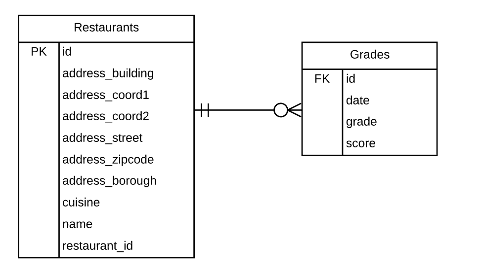

# How to Ingest Data From MongoDB with Node.js

Data ingestion from a NoSQL database often involves the denormalisation of their schema-less data before loading into a relational database. In this post, we will try to grab the restaurant data from MongoDB, denormalise the collection into a parent and a child table, and load them into Postgres.

This exercise has been previously done with Python. The post includes how to get the restaurants dataset and load it to MongoDB. If you need a little bit of guidance on the preparation, you can refer to How to Get Data From MongoDB with Python.

If you need a little bit of MongoDB refresher, check out the posts below:

MongoDB Skills Essential Exercise
User Management with MongoDB
MongoDB CRUD Operation with Node.js
Dataset

We are using the restaurant dataset from here. Download it as a JSON file and upload it to MongoDB (see here for detailed instruction).

Data Model

We are going to denormalise the dataset into the main restaurants table as a parent and the grades table as a child. Data model is below. For further information including SQL create table statements, see the previous post here.



Code

Our ingestion strategy is:

Get data from MongoDB.
Transform the format of the timestamp field for the child table.
Convert it into two csv files
Use the Postgres copy function to bulk insert data from the csv files.
First of all, we will create a module to perform truncate & load operations. The function is straight-forward. It takes csv file and upload it to a target table. Save it as copyPg.js. At the end of the file, we can export it with the module.export function.

I have covered the topic of bulk-loading data into Postgres with Node.js previously. It discusses the modules used for bulk-loading as well as using the config.json file to define connection details. Check out this post if you need a refresher (Converting JSON to CSV and Loading it to Postgress with Node.js).

```js
const fs = require("fs");
const { Client } = require("pg");
const copyFrom = require("pg-copy-streams").from;
const config = require("./config/config.json");

const truncateLoad = (inputPath, targetTable, callback) => {
  const client = new Client({
    user: config.pgUser,
    host: config.pgHost,
    database: config.pgDbname,
    password: config.pgPw,
    port: config.pgPort,
  });

  client.connect();
  console.log("Connected to database.");

  const queryExecute = (inputPathF, targetTableF, callback) => {
    console.log("Truncating Table...");
    client.query(`Truncate ${targetTableF} cascade;`, (err, results) => {
      if (err) {
        console.error(err);
        process.exit(1);
      }
      console.log(`Truncated ${targetTable}`);
      callback(inputPathF, targetTableF);
    });
  };

  queryExecute(inputPath, targetTable, () => {
    var stream = client.query(
      copyFrom(`COPY ${targetTable} FROM STDIN CSV HEADER`)
    );
    var fileStream = fs.createReadStream(inputPath);
    fileStream.on("error", (err) => {
      console.log(err);
      process.exit(1);
    });
    fileStream
      .pipe(stream)
      .on("error", (err) => {
        console.log(err);
        process.exit(1);
      })
      .on("end", (data) => {
        console.log(`Uploaded file to ${targetTable}`);
        client.end();
        console.log("PG connection closed.");
        callback();
      });
  });
};
```

Once, we have the custom module to load data, let’s write the main part. We first connect to MongoDB with the mongodb module. Then query the collection. The data from the query results is already a JSON object. Therefore, we can pass it to the json2csv converter without data type conversion.

Before passing it to the converter, we are going to reformat the date field from the ISODate format to the YYY-MM-DD HH:MM:SS format. The code snippet below is looping every date field in every grades array to pass the format functions.

```js
records.forEach((record, index, list) => {
  record.grades.forEach((grade, index, list) => {
    record.grades[index].date = grade.date
      .toISOString()
      .replace("T", " ")
      .substring(0, 19);
  });
});
```

To convert JSON into csv, I am using the json2csv module. It makes JSON manipulation easier and covers most of the conversion scenarios.

Finally, I am using the callback function to ensure the truncate & load event happens sequentially for two tables. The rest should be relatively simple.

```js
const config = require("./config/config.json");
const fs = require("fs");
const { MongoClient } = require("mongodb");
const json2csv = require("json2csv").parse;
const mongoUrl = config.mongoConnection;
const pgLoad = require("./copyPg.js");

const createCsv = (data, callback) => {
  const mainCsv = "./data/restaurants.csv";
  const fields = [
    { label: "id", value: "_id" },
    { label: "address_building", value: "address.building" },
    { label: "address_coord1", value: "address.coord[0]" },
    { label: "address_coord2", value: "address.coord[1]" },
    { label: "address_street", value: "address.street" },
    { label: "address_zipcode", value: "address.zipcode" },
    "borough",
    "cuisine",
    "name",
    "restaurant_id",
  ];
  const csv = json2csv(data, { fields });
  fs.writeFileSync(mainCsv, csv);
  console.log(`File created as ${mainCsv}`);
  callback();
};

const createGradeCsv = (data, callback) => {
  const gradesCsv = "./data/grades.csv";
  const fields = [
    { label: "id", value: "_id" },
    { label: "date", value: "grades.date" },
    { label: "grade", value: "grades.grade" },
    { label: "score", value: "grades.score" },
  ];
  const csv = json2csv(data, { fields, unwind: "grades" });
  fs.writeFileSync(gradesCsv, csv);
  console.log(`File created as ${gradesCsv}`);
  callback();
};

const fetchData = (callback) => {
  var buff = "";
  MongoClient.connect(mongoUrl, (err, client) => {
    if (err) {
      console.error(err);
      process.exit(1);
    } else {
      console.log("Connected to mongodb.");
      var db = client.db("test");
      var collection = db.collection("restaurants");
      collection.find({}).toArray((err, records) => {
        client.close();
        records.forEach((record, index, list) => {
          record.grades.forEach((grade, index, list) => {
            record.grades[index].date = grade.date
              .toISOString()
              .replace("T", " ")
              .substring(0, 19);
          });
        });
        console.log(records[0].grades[0].date);
        createCsv(records, () => {
          createGradeCsv(records, () => {
            callback();
          });
        });
      });
    }
  });
};

fetchData(() => {
  pgLoad("./data/restaurants.csv", "mongodb.restaurants", () => {
    pgLoad("./data/grades.csv", "mongodb.grades", () => {
      console.log("All operations finished.");
    });
  });
});
```

(2018-05-08)
